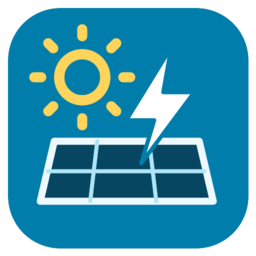

# Solarman Azzurro

Home Assistant custom integration for local, read-only telemetry from compatible ZCS Azzurro hybrid inverters through a Solarman V5 logger. Display name: **Solarman Azzurro**. Domain: `solarman_azzurro`.

No cloud account, external telemetry, runtime dependencies, or inverter write commands. Power and battery polling defaults to 10 seconds; counters, events and other readings default to 30 seconds. Both intervals are configurable from 1 to 300 seconds. One persistent TCP session is reused between reads, with heartbeat handling and reconnection after transport failures. This is periodic polling, not a push stream; values may also reflect the inverter's internal measurement cadence.

- [Installation, configuration and migration](docs/installation.md)
- [Supported profile, measurements and limits](docs/measurements.md)
- [Development and protocol verification](docs/development.md)
- [Event codes, messages and faults](docs/events.md)
- [GitHub publishing and HACS](docs/publishing.md)

[Add this repository to HACS](https://my.home-assistant.io/redirect/hacs_repository/?owner=ctz23&repository=solarman-azzurro&category=integration).

[Configure Solarman Azzurro in Home Assistant](https://my.home-assistant.io/redirect/config_flow_start/?domain=solarman_azzurro) after installing the component and restarting Home Assistant.

The initial experimental release supports the **HYD HP / Sofar G3 register map** tested on one single-phase Azzurro installation with a Solarman V5 logger. Other inverter generations and loggers are unverified. See the profile documentation before installation.

English and Italian UI translations are included. Entity labels use Home Assistant’s backend language, so Italian installations keep Italian labels while existing entity IDs are preserved. **Translations are welcome:** contributions for additional languages and improvements to existing translations are appreciated. See [how to contribute translations](docs/development.md#translations-i18n).

Licensed under MIT. Independent community project, unaffiliated with ZCS, Sofar or Solarman. Public repository publication and HACS submission are separate from local installation.
